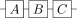
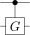
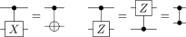
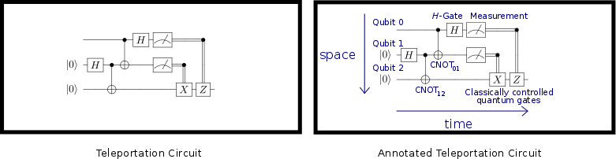

# 第0章 量子计算中的常用概念

### 什么是量子计算

在过去的几年中，出现了一系列新的计算机技术，其中量子计算可能是最需要开发者转变开发模式的技术。量子计算机是在上世纪80年代，由Richard Feynman和Yuri Manin提出的。经过了多年的发展，人类虽然在科学技术上取得了非凡的成就，但我们依然面对着一个尴尬的情景：非凡的科学进展却对简单的系统无能为力。这也是量子计算背后的灵感和驱动力的来源。如你所见，早在1900~1925年间，量子力学的框架就已经被建立起来了，它是化学、凝聚态物理和从计算机芯片到LED照明再到其他技术的基石。尽管取得了很大的成就，但是利用量子力学去对一些非常简单的系统进行建模时仍然超出了人类的能力水平，因为即使是模拟几十个粒子相互作用的系统，所需要的计算能力也超过当今任何计算机持续计算数千年以上所能提供的计算能力。

量子力学为何难以模拟？在量子水平上，同时存在着一系列可能的不同架构（也叫状态，量子态），不同于经典的概率论，这些能够被潜在观察到的状态可能会像水池中的波纹一样相互干扰，这种干扰阻碍了使用统计抽样来获取量子态的架构，并且，如果我们想要理解量子演进，那就必须追踪一个量子系统中所有的可能状态。

设想一个由电子组成的系统，其中电子可以出现在40个位置中的任何一个上，那么这个系统就存在$$2 ^ {40}$$种状态（每个位置上可能有也可能没有电子存在），在一个传统的计算机存储器上存储这些状态就需要130Gb的空间，这个存储当今的一些计算机还是可以满足的，但是如果将40变为41，多了一个位置就会导致存储空间的翻倍。如果我们继续按照常规办法这么做下去，这个增加位置的游戏马上就会进入死局，因为世界上最强大的存储设备也无法满足这样的指数增长。将电子数量扩大到数百个，那么所需要的存储空间甚至会超过宇宙中粒子的数量，因此使用传统的计算机无法模拟量子力学模型。

这一问题引导着那些对量子计算有着早期愿景的人们思考这样一个问题：我们能否将这一挑战转变为一个机遇。量子力学难以模拟，那如果我们利用量子特性来建造量子硬件会发生什么呢？我们能否直接利用量子力学的机制来模拟相互作用的量子系统呢？正是这些问题催生了量子计算。

量子计算的基础核心问题是是将信息存储在物质的量子态中，并使用量子门操作在这些信息上利用量子干涉效应进行计算。一个早期的利用对量子干涉效应编程来解决问题的例子是由 Peter Shor在1994年完成的，这是一个因式分解问题，对一个较大的数进行因式分解对传统计算机来说是困难的，解决因式分解问题能使现今电子商务安全基础上的许多公钥密码体制失效，例如RSA和ECDLP。到了那个时候，快速高效的量子算法被开发出来，能为我们解决许多经典计算机难以解决的难题：模拟化学、物理和材料科学中的物理系统，搜索无序数据库，求解线性方程组和机器学习等。

设计一个利用量子干涉的程序听起来像是一个艰巨的挑战，事实也确实如此，但目前已经有许多技术和工具包括微软的量子开发工具包使量子程序和算法的开发更便捷。现实中有一些基本的对计算有用的策略可以被用来操控量子干涉，同时不会造成量子纠缠中的解丢失。量子编程是一种与经典编程截然不同的艺术，它需要用完全不同的工具去理解和表达编程思想，实际上，如果没有合适的工具来帮助开发者解决量子编程中的问题，量子程序的开发就会变得异常复杂困难。

我们推出了微软量子程序开发工具包来推动正在成长的量子编程社区的发展，工具包中包含了多种针对具体任务、问题和解决方案的工具。我们的高级程序语言Q\#旨在解决量子信息处理的挑战，它集成在一个软件栈中，使得量子算法能被编译成量子计算机的基本操作。在走进Q\#之前，回顾一下量子计算的基本概念是很有帮助的，在本书中，我们将把量子计算的基本规则作为公理，而不会详述量子力学的基础，并且我们假定读者有一定的线性代数基础（向量、矩阵等），如果你需要更深入地了解量子计算的历史和原理，请参考[https://docs.microsoft.com/zh-cn/quantum/quantum-formoreinfo?view=qsharp-preview。](https://docs.microsoft.com/zh-cn/quantum/quantum-formoreinfo?view=qsharp-preview。)

### 量子比特

比特是经典计算中信息的基本对象，量子比特则是量子计算中信息的基本对象。

#### 量子比特的表示

一个二进制比特的值可以是0或1，而一个量子比特的值除了可以是0或1，还可以是这两个值的量子叠加，一个量子比特的状态可以用一个二维的单位向量来描述，这个向量叫做**量子态向量**，它保存了要描述一个单量子系统状态所需要的全部信息。

任意一个范数为1的二维实向量或复向量都能表示一个量子位的状态，所以以下向量都属于量子态向量。

在所有量子态向量中，$$\begin{bmatrix} 1 \\  0 \end{bmatrix}$$和$$\begin{bmatrix} 0 \\  1 \end{bmatrix}$$ 有着特殊的作用，它们构成了描述量子状态的向量空间的基，这意味着任何一个量子态向量都可以用这两个基的代数和来表示，例如，向量$$\begin{bmatrix} x \\  y \end{bmatrix}$$ 可以写做$$x \begin{bmatrix} 1 \\ 0 \end{bmatrix} + y \begin{bmatrix} 0 \\  1 \end{bmatrix}$$ ，因此，这两个向量又被成为**计算基底**。

同时，我们将上述两个基所代表的量子态与经典计算中的比特位相对应，它们之间的关系为：

$$0\equiv \begin{bmatrix} 1 \\ 0 \end{bmatrix}\qquad 1 \equiv \begin{bmatrix} 0 \\ 1 \end{bmatrix}$$

#### 量子态的测量

我们已经知道了如何表示一个量子比特，那么一个量子比特的状态到底代表了什么呢？现在我们通过探讨量子态测量的概念来建立一个对量子态的认识。量子态的测量就是对量子状态的观察，根据量子力学的原理，观察一个量子会使其状态坍缩至两个经典状态$$\begin{bmatrix} 1 \\  0 \end{bmatrix}$$和$$\begin{bmatrix} 0 \\  1 \end{bmatrix}$$中的一个，当一个状态为$$\begin{bmatrix} \alpha \\  \beta \end{bmatrix}$$的量子被测量后，我们得到$$0$$的概率为$$\|\alpha\|^2$$，得到$$1$$的概率为$$\|\beta\|^2$$，并且$$\|\alpha\|^2 + \|\beta\|^2 = 1$$ 。根据上述量子态测量的性质，我们可以知道一个量子态矩阵与其符号是不相关的，这个向量与其反向量等价：$$\alpha \rightarrow -\alpha$$ , $$\beta \rightarrow -\beta$$ 。这是因为测量到$$0$$和$$1$$的概率取决于$$\alpha$$和$$\beta$$的平法的大小，在他们之前插入一个符号并不改变测量结果的概率分布。

有关测量的最后一个重要性质是测量并不会使所有量子态都发生改变。如果我们测量一个状态为$$\begin{bmatrix} 1 \\  0 \end{bmatrix}$$的量子，相当于经典计算中的比特$$0$$，那么我们得到的测量结果仍然为$$0$$，且量子本身的状态也不会改变。从这个意义上讲，如果我们只拥有经典的比特位，我们对这些比特位进行测量也不会改变它们状态，这意味着我们能够将经典计算的数据复制到量子计算机上，然后像在经典计算机上那样对其进行处理。

### 利用布罗兹球面可视化量子态和其转换

量子位也可以使用布罗兹球面3D化显示。布罗兹球面用三维的实值向量来描述单个量子的量子态。如上所述，单个量子的状态由一个二维向量来描述。布罗兹球面使得一个量子的状态可视化，正因此，它在我们理解多量子状态时也有极大的作用。可视化的布罗兹球面如下所示：

  
    图0.1 布罗兹球面

图中的箭头指示了量子态向量的方向，箭头的每一次变换都可以看作是一个基本轴的旋转，那么自然而然我们可以将量子态的变换看做是一系列的旋转变换。当然使用这种思想来设计和描述量子算法也是一个不小的挑战，但Q\#为我们提供了能够方便地描述这些旋转操作的语言，从而简化了我们解决问题的负担。

### 单个量子位的操作

量子计算机通过应用一组能模拟量子态向量旋转的量子门来处理数据，量子门的概念与传统计算机中的门的概念类似，如果每一个输入比特的变换都可以用有限长的量子门来执行，则对应的量子门集合被认为是通用的。

在量子计算中，我们能够在量子比特上执行的有效的变换包括幺正变化和测量。共轭操作也叫复共轭转置，他对量子计算有着至关重要的作用，因为在量子信息翻转中经常需要用到它。Q\#能自动将量子门序列编译成它们的共轭矩阵，将开发者从手工编码的泥潭中解放出来，大大减轻了开发者的负担。

在经典计算中，只有四种操作将一个比特映射到另一个比特（与、或、非、异或），但在量子计算机中，变换一个量子比特状态的操作是无穷的，因此在量子计算中，不存在一个有限的基本操作集合（门集合）能完全覆盖量子计算中有效而无穷的幺正变换，这也意味着，量子计算机不可能像经典计算机那样使用有限的门操作来实现所有的量子算法，所以量子计算机不会像经典计算机那样通用。当我们谈到一个门集合对量子计算是通用的时候，我们实际要表达的意思要比完全通用弱化。对于通用性，我们要求量子计算机只在一个有限的误差内使用一个有限长的门序列来逼近任意幺正矩阵即可，或者说，只要任意的幺正变换在误差允许范围内能够写作一个有限长的门操作序列的张量积，那么这个门集合就是通用的，如下所示：

$$G_N G_{N-1} \cdots G_2 G_1 \approx U.$$

注意因为矩阵乘法是从右向左计算的，因此上面公式中的$$G_{N}$$实际上是最后一个被应用到的门操作。更正规地说，对于误差$$\epsilon > 0$$，存在$$G_1,\ldots, G_N$$使得$$G_N\ldots G_1$$ 和 $$U$$的偏差不超过$$\epsilon$$，那么我们就说集合$$G_1,\ldots, G_N$$是通用的。

现实中，这样的通用门集合是什么样的呢？对单量子门而言，这样的集合中只包含两个门：Hadamard门（H门）和T门（也叫做$$\pi/8$$门）：  
$$H=\frac{1}{\sqrt{2}}\begin{bmatrix} 1 ; 1 \\  1  ;-1  \end{bmatrix},\qquad T=\begin{bmatrix} 1  ; 0 \\  0  ; e^{i\pi/4} \end{bmatrix}.$$

但是考虑到量子计算的实用性，一个更大的集合能够带来更多的便利，集合中其他的门可以由H和T门生成，我们将这些量子门分为两类：Clifford门和T门，这样分类是因为Clifford门能够很方便地应用在许多量子纠错方案中，且他们只需要很少的资源就能实现较好的容错率，然而非Clifford门的消耗就非常大了。在Q\#中，标准的单量子Clifford门包括：  
$$H=\frac{1}{\sqrt{2}}\begin{bmatrix} 1 ; 1 \\  1  ;-1  \end{bmatrix} ,\qquad S =\begin{bmatrix} 1  ; 0 \\  0  ; i \end{bmatrix}= T^2,\qquad X=\begin{bmatrix} 0  ;1 \\  1 ; 0 \end{bmatrix}= HT^4H,$$$$Y = \begin{bmatrix} 0 ; -i \\  i ; 0 \end{bmatrix}=T^2HT^4  HT^6, \qquad Z=\begin{bmatrix}1;0\\ 0;-1 \end{bmatrix}=T^4.$$

这些门中，X、Y和Z应用的非常广泛，它们也被成为Pauli操作符，这些门操作和非Clifford门一起就能组合出任意幺正变换作用于单个量子上。下面的例子展示了如何用这些基本操作构建一个幺正变换，图0.1中的三个变换对应于以下门操作序列：  
$$\begin{bmatrix} 1 \\  0 \end{bmatrix} \mapsto HZH \begin{bmatrix} 1 \\  0 \end{bmatrix} = \begin{bmatrix} 0 \\  1 \end{bmatrix}$$

前面的门操作在堆栈逻辑级别上构成了最基本的原语（逻辑级别等同与量子算法级别），但在算法级别较少地考虑基本操作会带来更大的便利，比如在编程中应多使用近似函数级别的操作。幸运的是Q\#中包含有很多用于实现高层次幺正变换的方法，有了他们我们在实现更高层次的算法时就不需要将其分解为基本的Clifford和T门。

最简单的原语是单量子旋转操作。将三个单量子旋转用$$R_{x}$$、$$R_{y}$$和$$R_{z}$$表示，为了可视化旋转操作$$R_x(\theta)$$的行为，将右手大拇指指向布罗兹球面$$x$$轴的方向，然后右手旋转$$\theta/2$$弧度，相应的幺正变换为：  
$$R_z(\theta) = \begin{bmatrix} e^{-i\theta/2} ; 0\\  0 ; e^{i\theta/2} \end{bmatrix},\qquad R_x(\theta) = H R_z(\theta) H, \qquad R_y(\theta) = SHR_z(\theta)HS^\dagger.$$

正如将任意三个旋转操作组合起来就能完成三维空间中的任意旋转，布罗兹球面所表示的任意幺正矩阵也能写成由三个旋转操作组成的序列，特别地，对每一个幺正矩阵$$U$$都有$$\alpha,\beta,\gamma,\delta$$使得$$U= e^{i\alpha} R_x(\beta)R_z(\gamma)R_x(\delta)$$。因此$$R_x(\theta)$$和H门也可以构成一个通用的量子门集合，当然了，因为$$\theta$$可以是任意值，因此构成的量子门集合就不是离散的了，并且考虑到量子模拟的应用场景，连续的量子门对量子计算是至关重要的，特别是在量子算法的设计层面上。最终，这些操作会被编译成离散的满足误差要求的量子门序列实现这些旋转操作。

### 多量子比特

虽然单量子比特拥有一些反直观的特性，例如在某一时刻同时存在多种状态，但是如果一个量子计算机中只有单量子比特门，那它所能提供的运算能力甚至不如现在的一台小小的计算器，更不用说超级计算机了。只有增加量子数，量子计算的真正能力才能体现出来，这种能力的增长，部分原因来自与量子态向量空间的维数随量子数的增加而指数上升。这也意味着单量子系统建模比较容易，而对50个量子进行模拟就会对目前的超级计算机造成压力，每增加一个量子比特，所需要的存储空间和计算时间就会翻倍。

这一节的目标是在单量子态之外重新审视构建多量子态的规则，同时我们也会探讨要构建一台通用的量子计算机，需要那些门操作。Q\#中提供了一些工具使我们是理解多量子门的过程中绝对需要的，它们也会帮助我们理解为什么应用了量子效应如量子纠缠和量子干涉后就能使量子计算机比传统计算机强大那么多。

#### 双量子比特的表示

单量子比特与双量子比特之间的主要区别在于双量子态向量是4维而单量子态向量是2维，这是因为双量子态的计算基底是通过单量子态向量的张量积得到的，如下所示：  
$$\begin{align}
00 \equiv \begin{bmatrix}1 \\ 0 \end{bmatrix}\otimes \begin{bmatrix}1 \\ 0 \end{bmatrix} ;= \begin{bmatrix}1 \\ 0\\ 0\\ 0 \end{bmatrix},\qquad 01 \equiv \begin{bmatrix}1 \\ 0 \end{bmatrix}\otimes \begin{bmatrix}0 \\ 1 \end{bmatrix} = \begin{bmatrix}0 \\ 1\\ 0\\ 0 \end{bmatrix},\\
       10 \equiv \begin{bmatrix}0 \\ 1 \end{bmatrix}\otimes \begin{bmatrix}1 \\ 0 \end{bmatrix} ;= \begin{bmatrix}0 \\ 0\\ 1\\ 0 \end{bmatrix},\qquad 11 \equiv \begin{bmatrix}0 \\ 1 \end{bmatrix}\otimes \begin{bmatrix}0 \\ 1 \end{bmatrix} = \begin{bmatrix}0 \\ 0\\ 0\\ 1 \end{bmatrix}.
       \end{align}$$

容易知道，$$n$$个量子的量子态向量可以通过$$2^{n}$$维的单位向量用同样的方法进行构造。向量$$\begin{bmatrix} \alpha_{00} \\  \alpha_{01} \\  \alpha_{10} \\  \alpha_{11} \end{bmatrix}$$如果满足$$|\alpha_{00}|^2+|\alpha_{01}|^2+|\alpha_{10}|^2+|\alpha_{11}|^2=1$$，那么它就代表了一个双量子系统的量子态。与单量子类似，多量子态向量保存着描述多量子系统状态的所有信息。

如果给出两个独立的量子比特，一个状态为$$\begin{bmatrix} \alpha \\  \beta \end{bmatrix}$$，另一个状态为$$\begin{bmatrix} \gamma \\  \delta \end{bmatrix}$$，那么这两个量子比特组成的双量子系统的状态就是：  
$$\begin{bmatrix} \alpha \\  \beta \end{bmatrix} \otimes \begin{bmatrix} \gamma \\  \delta \end{bmatrix} 
=\begin{bmatrix} \alpha \begin{bmatrix} \gamma \\  \delta \end{bmatrix} \\ \beta \begin{bmatrix}\gamma \\  \delta \end{bmatrix} \end{bmatrix}
= \begin{bmatrix} \alpha\gamma \\  \alpha\delta \\  \beta\gamma \\  \beta\delta \end{bmatrix},$$

上面的$$\otimes$$符号表示向量的张量积（克罗内克积）。需要注意的是，虽然我们总能使用两个单量子态向量来构建一个双量子系统的量子态向量，但并非所有的双量子系统状态都能表示成两个单量子态向量的张量积。例如，不存在这样两个向量$$\psi=\begin{bmatrix} \alpha \  \beta \end{bmatrix}$ and $\phi=\begin{bmatrix} \gamma \  \delta \end{bmatrix}$$，使得他们的张量积为：$$\psi\otimes \phi = \begin{bmatrix} 1/\sqrt{2} \  0 \  0 \  1/\sqrt{2} \end{bmatrix}.$$

不能用两个单量子态向量的张量积来表示的双量子态叫做“纠缠态”，这两个量子比特被称为纠缠的。不严格地说，双量子态不能被认为是两个单量子比特的张量积，这个状态所持有的信息也不局限于两个单量子态中的一个，而是非局部地存储于两个量子态之间的联系中，这种信息的非局部性是量子计算和传统计算之间的主要区别之一，其对许多量子协议也是必不可少的，比如量子隐形传态和量子纠错。

#### 双量子态的测量

双量子比特量子态的测量与单量子类似。测量一个状态为：  
$$\begin{bmatrix} \alpha_{00} \\ \alpha_{01} \\ \alpha_{10} \\ \alpha_{11} \end{bmatrix} $$  
的双量子系统，有$$|\alpha_{00}|^2$$的概率得到结果$$00$$，$$|\alpha_{01}|^2$$的概率得到结果$$01$$，$$|\alpha_{10}|^2$$的概率得到结果$$10$$，$$|\alpha_{11}|^2$$的概率得到结果$$11$$。在测量之后如果得到的结果是$$00$$，那么此时双量子系统的量子态已经坍塌为：  
$$ 00 \equiv \begin{bmatrix} 1 \\ 0 \\ 0 \\ 0 \end{bmatrix}.  $$

测量一个双量子系统中的某个量子的状态也是可行的，在只测量一个量子位的情况下，测量的影响是稍微不同的，因为整个系统的状态不会坍塌到计算基底状态，而是坍塌到一个子系统，或者说，测量一个量子位只是让双量子系统中的一个子系统坍缩而不是整个系统。为了理解这个现象，考虑测量如下所示状态中的第一个量子：  
$$H^{\otimes 2} \left( \begin{bmatrix}1 \\ 0 \end{bmatrix}\otimes \begin{bmatrix}1 \\ 0 \end{bmatrix} \right) = \frac{1}{2}\begin{bmatrix}1\\ 1\\ 1\\ 1\end{bmatrix}\mapsto \begin{cases}\text{outcome }=0 ; \frac{1}{\sqrt{2}}\begin{bmatrix}1\\ 1\\ 0\\ 0 \end{bmatrix}\\ \text{outcome }=1  ; \frac{1}{\sqrt{2}}\begin{bmatrix}0\\ 0\\ 1\\ 1 \end{bmatrix}\\  \end{cases}.$$

两个输出结果各占50%的概率。测量第一个或第二个量子比特状态的数学规则很简单，假设我们让$$e_{k}$$表示第$$k$$个基向量，让$$S$$表示所有第$$k$$个元素为$$1$$的向量的集合，例如我们要测量第一个量子的状态，那么$$S$$中包括$$e_2\equiv 10$$和$$e_3\equiv 11$$，如果要测量第二个量子的状态，那么$$S$$就由$$e_1\equiv 01$$和$$e_3 \equiv 11$$组成。对于量子态向量为$$\psi$$的量子，测量得到其状态为$$1$$的概率为：  
$$P(\text{outcome}=1)= \sum_{k \text{ in the set } S}\psi^\dagger e_k e_k^\dagger \psi.$$

因为测量量子比特所得的结果只能是$$0$$或者$$1$$，得到$$0$$的概率就是$$1-P(\text{outcome}=1)$$。这样的测量行为可以用数学形式表述为：  
$$ \psi \mapsto \frac{\sum_{k \text{ in the set } S} e_k e_k^\dagger \psi}{\sqrt{P(\text{outcome}=1)}}.  $$

如果我们将上面的向量$$ \psi $$看做单位向量，那么测量第一个量子得到$$1$$的概率为：  
$$ P(\text{measurement of first qubit}=1) = (\psi^\dagger e_2)(e_2^\dagger \psi)+(\psi^\dagger e_3)(e_3^\dagger \psi)=|e_2^\dagger \psi|^2+|e_3^\dagger \psi|^2.  $$

注意，这只是测量结果的两个概率的总和，$$10$$和$$11$$是所有要测量的量子，对我们上面的例子而言，计算时是这样的：  
$$ \frac{1}{4}\left|\begin{bmatrix}0;0 ;1 ;0\end{bmatrix}\begin{bmatrix}1\\ 1\\ 1\\ 1\end{bmatrix} \right|^2+\frac{1}{4}\left|\begin{bmatrix}0 ;0 ;0 ;1\end{bmatrix}\begin{bmatrix}1\\ 1\\ 1\\ 1\end{bmatrix} \right|^2=\frac{1}{2}.  $$

同时，对应的量子态也可以写作：  
$$ \frac{\frac{e_2}{2}+\frac{e_3}{2}}{\sqrt{\frac{1}{2}}}=\frac{1}{\sqrt{2}}\begin{bmatrix} 0\\ 0\\ 1\\ 1\end{bmatrix} $$

#### 双量子比特操作

在单量子情况下，任何幺正变换都是有效的，而施加于多量子系统上的幺正变换是一个大小为$$ 2 ^ {n} \times 2 ^{n} $$的矩阵（所以它作用与大小为$$2^{n}$$的向量上）并且$$U^{-1} = U^\dagger$$。例如，CNOT（controlled-NOT）门是一个用途广泛的双量子门，它使用如下单位矩阵表示：  
$$\operatorname{CNOT} = \begin{bmatrix} 1\ 0\ 0\ 0  \\  0\ 1\ 0\ 0 \\  0\ 0\ 0\ 1 \\  0\ 0\ 1\ 0 \end{bmatrix}$$

我们也可用单量子门操作来构造双量子门。假设对一个双量子系统，我们对其第一个和第二个量子比特分别应用下面两个门：  
$$ \begin{bmatrix} a\ b\\ c\ d \end{bmatrix} \begin{bmatrix} e\ f\\ g\ h \end{bmatrix} $$

这等价于对双量子态向量应用这两个门的张量积：  
$$\begin{bmatrix}
a\ b\\ c\ d
\end{bmatrix}
\otimes 
\begin{bmatrix}
e\ f\\ g\ h
\end{bmatrix}=
\begin{bmatrix}
ae\ af\ be\ bf \\
        ag\ ah\ bg\ bh \\
        ce\ cf\ de\ df \\
        cg\ ch\ dg\ dh
        \end{bmatrix}.$$

因此，我们可以使用已知的单量子门来构建双量子门，这样的例子包括：$$H \otimes H$$, $$X \otimes 1$$,和 $$X \otimes Z$$。

虽然两个单量子门的张量积可以定义一个双量子门，但所有的双量子门并非都能由单量子门构建而成，不能由两个单量子门的张量积表示的双量子门叫做纠缠门，CNOT门就是一个纠缠门。

对于CNOT门的认知可以推广到任意的门。一个受控的门一般来说扮演着身份验证的角色除非量子系统中一个特定的量子比特是$$1$$。我们将应用于量子比特$$x$$上的受控的幺正变换标记为$$\Lambda_x(U)$$，那么对于它有：$$\Lambda_0(U) e_{1}\otimes {\psi}=e_{1}\otimes U{\psi}$$和$$\Lambda_0(U) e_{0}\otimes {\psi}=e_{0}\otimes{\psi}$$，这里的$$e_{0}$$和$$e_{1}$$是量子态为$$0$$和$$1$$对应的单量子态基向量，例如对于下面的受控$$Z$$门，我们可以将其表示为：  
$$ \Lambda_0(Z)= \begin{bmatrix}1 0 0 0 \\ 0 1 0 0 \\ 0 0 1 0 \\ 0 0 0 -1 \end{bmatrix}=(1 \otimes H)\operatorname{CNOT}(1 \otimes H).  $$

用有效的方式构建受控的幺正变换是一个主要的挑战，实现这一点的最简单的方法是建立一个基础门操作的受控版本的数据库，并在最初的幺正变换中用受控操作替代对应的门操作。但这样做是相当浪费的，有一些灵巧的办法可以只替换某些门操作来达到同样的效果。在微软量子开发框架中，我们提供了原始的、受控的方法，并且也允许用户自定义一个幺正变换的受控版本。

量子门也可以受经典信息的控制。例如，一个经典的受控非门只在比特位为$$1$$时才起作用，根据这一点来看，经典的受控门可以看做代码中的一个if语句，只在某一分支上起作用。

与单量子类似，对于一个幺正矩阵，如果其可以使用一个双量子门集合中任何大小为$$4 \times 4$$量子门的向量积近似表示，那么这个双量子门集合就被认为是通用的。一个通用门集合的例子是由Hadamard门、T门和CNOT门组成的集合，通过这些门操作的向量积我们可以近似拟合出任意的作用于双量子系统的幺正矩阵。

#### 多量子系统

我们遵循在双量子系统中探索到的规则来构建多量子系统，多量子系统的状态由较小系统的张量积构建而来。例如，在量子计算机中将字符串“1011001”编码的方式为：  
$$ 1011001 \equiv \begin{bmatrix} 0 \\  1 \end{bmatrix}\otimes \begin{bmatrix} 1 \\  0 \end{bmatrix}\otimes \begin{bmatrix} 0 \\  1 \end{bmatrix}\otimes \begin{bmatrix} 0 \\  1 \end{bmatrix} \otimes \begin{bmatrix} 1 \\  0 \end{bmatrix}\otimes \begin{bmatrix} 1 \\  0 \end{bmatrix}\otimes \begin{bmatrix} 0 \\  1 \end{bmatrix}.  $$

量子门的工作方式与上面相同。例如，我们对多量子系统中的第一个量子比特应用$$X$$门，在第二个和第三个量子比特之间应用CNOT门，那么整个变换可以表示为：  
$$\begin{align} (X \otimes \operatorname{CNOT}_{12}\otimes 1 \otimes 1 \otimes 1) \begin{bmatrix} 0 \\  1 \end{bmatrix}\otimes \begin{bmatrix} 1 \\  0 \end{bmatrix}\otimes \begin{bmatrix} 0 \\  1 \end{bmatrix}\otimes \begin{bmatrix} 0 \\  1 \end{bmatrix} \otimes \begin{bmatrix} 1 \\  0 \end{bmatrix}\otimes \begin{bmatrix} 1 \\  0 \end{bmatrix}\otimes \begin{bmatrix} 0 \\  1 \end{bmatrix}\\ \qquad\qquad\equiv 0011001.  \end{align}$$

在多量子系统中，经常需要分配和释放计算机中临时的量子比特所占用的空间，这些临时的量子变量又叫做“附属（ancilla）”量子。默认情况下，新分配的量子比特都被初始化为$$e_{0}$$状态，我们进一步假定在释放之前，这个量子比特的状态重新回到$$e_{0}$$。这个假定很重要，因为如果一个附属量子在被释放时与其他量子寄存器纠缠，那么对它的释放就会破坏其他量子的状态，因此，我们认定一个量子比特被释放时要回到最初的状态。

最后，对于双量子系统来说，构建一个通用的量子门集合需要向集合中添加新的门，但对多量子系统来说这是不必要的。H、T和CNOT门就构成了多量子系统的一个通用门集合，因为任何一个幺正变换都可以分解为一系列的双量子的旋转。因此当面对多量子系统时，我们可以继续应用双量子系统中的相关理论。

目前我们都是使用线性代数中的符号来描述多量子系统，但随着量子数量的增多，这些表述将会变得非常繁琐，例如对于一个7位长的位串，其对应的量子态向量的维数就达到了128，因此，接下来我们将引入一个新的符号体系来描述量子系统，其能精确表达量子状态，同时使用起来非常便捷。

### 狄拉克符号

在线性代数中，列向量符号是无处不在的，但在量子计算中，特别是处理多量子系统时，向量符号就显得笨拙而繁琐。例如，我们定义两个向量$$\psi$$和$$\phi$$，但是我们并不知道它们是列向量还是行向量，也不知道它们的大小分别是多少。除了向量的形态，使用向量符号表示哪怕是非常简单的量子态也是一件繁琐的工作。比如，我们想要表达一个$$n$$量子比特的系统状态，这些量子比特处于$$0$$状态，那么正规的表示形式为：
$$\begin{bmatrix}1 \\  0 \end{bmatrix}\otimes \cdots \otimes\begin{bmatrix}1 \\  0 \end{bmatrix}. $$

当然，对这个张量积求值是不切实际的，因为向量都位于指数级别增长的空间中。

狄拉克符号是一种新的能够满足量子计算精确需求的语言，因此我们建议读者不要把本节中的例子看作是描述量子态的严格公式，而是鼓励读者把这些看作是可以用来简明表达量子思想的建议。

在狄拉克符号中有两种向量：左矢（Bra vector）和右失（Ket vector），之所以这样命名，是因为将两个向量放在一起时构成一个“braket”（狄拉克符号也叫braket符号），也就是向量内积内积。如果$$\psi$$是一个列向量，我们可以用狄拉克符号$$|\psi \rangle$$来表示，此处$$|\cdot \rangle$$表示一个单位列向量，比如右失就是这样的向量，类似的行向量$$\psi^\dagger$$可以表示为$$\langle \psi |$$，而符号$$\langle \psi |\psi \rangle$$就表示了向量$$\psi$$与其自身的内积，根据定义其值为$$1$$。

更一般的，如果$$\psi$$和$$\phi$$是量子态向量，他们的内积为：$$\langle \phi | \psi \rangle$$，并且测量量子态$$|{\psi}\rangle$$结果为$$|{\phi}\rangle$$的概率为$$|\langle \phi|\psi\rangle|^2$$。

下面所示是量子态$$0$$和$$1$$与狄拉克符号之间的关系：
$$ \begin{bmatrix} 1 \\  0 \end{bmatrix} = |0\rangle,\qquad \begin{bmatrix} 0 \\  1 \end{bmatrix} = |1\rangle.  $$

下面的符号通常用来描述对$$|0\rangle$$和$$|1\rangle$$应用Hadamard门所产生的状态（对应于布罗兹球面中的$$+x$$和$$-x$$方向）：
$$ \frac{1}{\sqrt{2}}\begin{bmatrix} 1 \\  1 \end{bmatrix}=H|0\rangle = |{+}\rangle,\qquad \frac{1}{\sqrt{2}}\begin{bmatrix} 1 \\  -1 \end{bmatrix} =H|1\rangle = |{-}\rangle .  $$

这些状态也可以使用狄拉克符号来表示：
$$ |+\rangle = \frac{1}{\sqrt{2}}(|0\rangle + |1\rangle),\qquad |-\rangle = \frac{1}{\sqrt{2}}(|0\rangle - |1\rangle).  $$

从上面的关系可以明白为什么这些状态被称为“计算基底”，因为任何一个量子态都能通过这些基底的代数和来表示，并且这些代数和形式能方便的使用狄拉克符号来表达。上面的转换关系反过来也是成立的，从下面的关系中可以看出，$$|+\rangle$$和$$|-\rangle$$构成了量子态基底。

作为一个使用狄拉克符号的例子，考虑$$0$$和$$1$$的内积，其可以使用狄拉克符号表示为：
$$ |0\rangle = \frac{1}{\sqrt{2}}(|+\rangle + |-\rangle),\qquad |1\rangle = \frac{1}{\sqrt{2}}(|+\rangle - |-\rangle).  $$

上面的例子说明了$$|0\rangle$$和$$|1\rangle$$是正交向量，即$$\langle 0 |1\rangle = \langle 1 | 0\rangle =0$$，同时，根据定义可以得到：$$\langle 0 | 0 \rangle = \langle 1 | 1\rangle=1$$，说明两个计算基底是标准正交的。在下面的例子中，可以看到标准正交性质的作用，假设存在状态$$|\psi\rangle = {\frac{3}{5}} |1\rangle + {\frac{4}{5}} |0\rangle$$，因为$$\langle 1 | 0\rangle =0$$，测量结果为1的概率为：
$$\big|\langle 1 | \psi\rangle \big|^2= \left|\frac{3}{5}\langle 1 | 1\rangle +\frac{4}{5}\langle 1 |0 \rangle\right|^2=\frac{9}{25}.$$

狄拉克符号还包含一个隐式的张量积结构。这是非常重要的，因为在量子计算中，使用两个不相关的量子寄存器描述的量子态向量是这两个不相关量子态的张量积。如果你想解释量子计算，那么能够简明描述张量积结构是非常重要的，狄拉克符号体系中，两个向量$$\psi$$和$$\phi$$的张量积$$\psi \otimes \phi$$可以写为$$|\psi\rangle |\phi\rangle$$，有时也写作：$$|\psi\rangle \otimes |\phi\rangle$$，例如：
$$ \begin{bmatrix} 1 \\  0 \\  0 \\  0 \end{bmatrix}= \begin{bmatrix} 1 \\  0 \end{bmatrix} \otimes \begin{bmatrix} 1 \\  0 \end{bmatrix} = |0\rangle \otimes |0\rangle= |0\rangle |0\rangle.  $$

类似地，状态$$|p \rangle$$表示一个使用整数$$p$$的二进制编码表示的量子态，例如，我们想使用二进制编码来表示整数5，那么下面的这几个表示是等同的：
$$ |{1}\rangle|{0}\rangle|{1}\rangle = |{101}\rangle = |{5}\rangle.  $$

在上面的等式中，$$|0\rangle$$不必是一个量子比特，而可以是一个存储了状态为$$0$$的量子比特的寄存器，这之间的区别可以根据上下文的环境进行区分，同时，这种转换在简化某些表达上是很有用处的，例如本节中的第一个例子就可以写作：
$$ \begin{bmatrix}1 \\  0 \end{bmatrix}\otimes \cdots \otimes\begin{bmatrix}1 \\  0 \end{bmatrix} = |0\rangle \otimes \cdots \otimes |0\rangle= |0\cdots 0\rangle = |0\rangle^{\otimes n} = |0\rangle.  $$

另一个使用狄拉克符号来表示量子态的例子如下所示，在每一个长度为$$n$$的位串上写入一个相等的叠加态：
$$H^{\otimes n} |{0}\rangle = \frac{1}{2^{n/2}} \sum_{j=0}^{2^n-1} |{j}\rangle=|+\rangle^{\otimes n}.$$

这里你可能会想知道为什么对于$$n$$个比特，加和的范围是$$0$$到$$2^{n}-1$$。首先，注意对n个比特，可能的构型有$$2^{n}$$种，因为每个比特都有两个可选的值。同时要说明的是，在这个例子中，我们没有像$$|0\rangle^{\otimes n} = |0\rangle$$一样将$$|+\rangle^{\otimes n}$$简化为$$|+\rangle^{\otimes n}=|+\rangle$$，因为这个转换惯例通常是保留给每个初始状态为$$0$$的计算基底的，虽然$$|+\rangle^{\otimes n}=|+\rangle$$这样表达也是有意义的，但是并没有被引入量子计算的书面表达中。

除了简明的优点，狄拉克符号的另一个优点就是其是线性的。例如，对于下面向量的张量积，我们可以写为：
$$(\alpha |\psi\rangle +\beta|\phi\rangle)\otimes (\gamma |\chi\rangle + \delta |\omega\rangle)= \alpha\gamma |\psi\rangle|\chi\rangle + \alpha\delta |\psi\rangle|\omega\rangle+\beta\gamma|\phi\rangle|\chi\rangle+\beta\omega|\phi\rangle|\omega\rangle.$$

从上面的例子可以看出，将张量积用狄拉克符号表示时，就像是普通的乘法一样简单明了。

左失遵循与右失类似的惯例。例如，向量$$\langle\psi|\langle \phi|$$与状态向量$$\psi^\dagger \otimes \phi^\dagger=(\psi\otimes \phi)^\dagger$$相等。如果右失$$|\psi\rangle$$是$$\alpha |0\rangle + \beta |1\rangle$$，那么对应的左失就是$$\langle{\psi}|=|\psi\rangle^\dagger = (\langle 0|\alpha^* +\langle 1 |\beta^*)$$。举一个例子，假设我们要计算使用一个量子测量程序测量$$|\psi\rangle = \frac{3}{5} |1\rangle + \frac{4}{5} |0\rangle$$的状态为$$|+\rangle$$或$$|-\rangle$$的概率，那么所得的概率为：
$$|\langle - |\psi\rangle|^2= \left|\frac{1}{\sqrt{2}}(\langle 0| - \langle 1|)(\frac{3}{5} |1\rangle + \frac{4}{5} |0\rangle) \right|^2=\left|-\frac{3}{5\sqrt{2}} + \frac{4}{5\sqrt{2}}\right|^2=\frac{1}{50}.$$

在概率计算中出现负号是量子干涉的一种表现形式，量子干涉也是量子计算之所以优于传统计算的机制之一。

狄拉克符号体系中，最后一项值得被讨论的优点是*ketbra*，也就是外积。用狄拉克符号表示外积的形式为$$|\psi\rangle \langle \phi|$$，它也被叫做*ketbra*，可以看到它与内积*braket*中的符号是相反的。对于两个量子态向量$$\psi$$和$$\phi$$，它们的外积是通过矩阵乘法定义的：$$|\psi\rangle \langle \phi| = \psi \phi^\dagger$$，一个很简单的关于外积的例子如下所示:
$$|0\rangle \langle 0| = \begin{bmatrix}1\\ 0 \end{bmatrix}\begin{bmatrix}1&0 \end{bmatrix}= \begin{bmatrix}1 &0\\ 0 &0\end{bmatrix} \qquad |1\rangle \langle 1| = \begin{bmatrix}0\\ 1 \end{bmatrix}\begin{bmatrix}0&1 \end{bmatrix}= \begin{bmatrix}0 &0\\ 0 &1\end{bmatrix}.$$

外积也被称为投影，因为他们将一个量子态向量投影到了一个固定值上。因为这些操作不是幺正的（也不会保持一个向量的范数），那么毫无疑问，量子计算机不能确定地进行投影操作，然而，投影能很好地描述测量操作对量子比特的作用，例如我们测量一个状态为$$\psi$$的量子得到的结果为$$0$$，那么作为测量结果的状态所经历的变换为：
$$|\psi \rangle \rightarrow \frac{(|0\rangle \langle 0|)|\psi\rangle}{|\langle 0|\psi\rangle|}= |0\rangle,$$

上面的结果是测量一个量子所得结果为$$|0\rangle$$的期望。重申一下，这样的投影不能确定地作用在量子计算机中，相反，他们至多以一定的概率随机与量子态$$|0\rangle$$发生作用。这种测量结果的概率可以写成量子态中量子投影的期望值：
$$\langle \psi| (|0\rangle \langle 0|)|\psi\rangle = |\langle \psi|0\rangle|^2,$$
这也说明了投影给出了一个新的测量量子状态的方法。

假设我们想要测量一个多量子系统中第一个量子比特的状态，那么可以只用投影和狄拉克符号方便地表示为：
$$P(\text{first qubit = 1})= \langle\psi|\left(|1\rangle\langle{1}|\otimes \mathbf{1}^{\otimes n-1}\right) |\psi\rangle.$$

这里的单位矩阵可以使用狄拉克符号表示为：
$$\mathbf{1}= |0\rangle \langle 0|+|1\rangle \langle 1|= \begin{bmatrix}1&0\\ 0&1 \end{bmatrix}.$$

对于双量子系统，投影可以被扩展为：
$$|1\rangle \langle 1| \otimes \mathbf{1} = |1\rangle\langle 1 \otimes (|0\rangle \langle 0|+|1\rangle \langle 1|)= |10\rangle\langle 10| + |11\rangle\langle 11|.$$

可以看出这与我们对使用列向量符号描述多量子系统状态测量结果的可能性的讨论是一致的：
$$P(\text{first qubit = 1})= \psi^\dagger (e_{10}e_{10}^\dagger + e_{11}e_{11}^\dagger)\psi = |e_{10}^\dagger \psi|^2 + |e_{11}^\dagger \psi|^2,$$
上面的式子与多量子状态测量的探讨结果是一致的。然而，对于多量子系统，上述结果的推广用狄拉克符号表示比使用列向量符号更直接。

在狄拉克符号体系中，其他有用的操作符还有状态操作符。对于一个量子态向量来说，状态操作符的形式为：$$\rho = |\psi\rangle \langle \psi|$$，这个将量子态描述为矩阵而非向量的方法是很方便的，因为它给出了一个简便的表示概率计算的方法，同时也允许我们使用相同的形式既可以表示统计学上的不确定性，也可以表达量子计算的不确定性。通用的量子操作符（非向量）在量子计算的某些领域中是普遍存在的，但理解该领域的基础知识并不是必须的，对于感兴趣的读者可以在[这里](https://docs.microsoft.com/en-us/quantum/quantum-formoreinfo?view=qsharp-preview)找到更多信息。

在本文开始时，量子态是量子计算中的基本对象，但是Q#中并没有直接表示量子态的符号，相反，所有的状态都通过对量子比特的筹备操作来描述。前面的例子对此是一个很好的说明，对于在寄存器中的每一个量子位串，表达对它们进行平均叠加操作，我们可以将结果表述为：$$H^{\otimes n} |{0}\rangle$$，这个简短的指数式表达不仅使我们可以方便的解释它，同时它也定义了实现一个算法需要的通过软件栈来传播的操作。因此，Q#被设计为触发量子门序列而不是量子态，当然，理论层面上来讲，它们是等价的。

### 泡利测量

在前面的讨论中，我们重点关注了计算基底测量，实际上在量子计算中还有其他一些常用的测量方式，从符号学的观点来说，这些测量使用计算基底的方式表达起来也很方便，在这些方式之中，泡利测量最常用。

在深入研究抛离测量之前，考虑一下在量子计算机中，测量一个量子比特时到底发生了什么？想象一下我们有一个$$n$$比特量子态，它所处于的状态可能有$$2^{n}$$中，然后测量其中一个量子比特，此时该多量子态的状态就被排除了一半，也就是说，测量操作将量子态投影到了两个半空间中的一个。

为了简洁地确认这些子空间，我们需要一个描述它们的语言。一个方法是使用一个只有两个特征值的矩阵来区分它们，这两个特征值一般取$$\pm 1$$，最简单的例子就是：
$$Z= \begin{bmatrix}1&0\\ 0&-1\end{bmatrix}. $$

Pauli-Z矩阵有两个特征向量$$|0\rangle$$和$$|1\rangle$$分别对应特征值$$\pm 1$$。如果测量一个量子比特得到的结果为$$|0\rangle$$那么我们就处于Z的特征值为$$+1$$的特征空间中，想法如果测量得到了$$|1\rangle$$，那么就处于Z的特征值为$$-1$$的特征空间中。这样的处理对应于泡利测量语言中的“测量泡利Z（measuring Pauli Z)”并且与执行计算基底测量是等价的。

当然，任何一个$$2 \times 2$$大小的Z的幺正变换都符合上面的标准。这也就是说，对于任意幺正矩阵$$U$$，我们可以使用矩阵$$A=U^\dagger Z U$$来定义与其特征空间相对应的测量的输出。泡利测量中使用符号$$X$$、$$Y$$和$$Z$$表示这一过程，如下所示：
$$
\begin{array}{|c|c|}
\text{Pauli Measurement} ; U\\ 
Z ; \mathbf{1}\\ 
X ; H\\ 
Y ; HS^\dagger\\ 
\end{array}
$$

同样，使用相同的语言，"measure Y"与先应用$$HS^\dagger$$然后在计算基底上测量是等价的，其中$$S$$也叫做相位门：
$$
\begin{bmatrix}1 ;0\\  0;i\end{bmatrix}.
$$

对量子态向量应用$$HS$\dagger$$然后测量$$Z$$也是很方便的，正确的状态可以在这之后应用$$SH$$获得。

多量子泡利测量操作符的定义是类似的，如下所示：
$$
Z\otimes Z = \begin{bmatrix}1 ;0 ;0;0\\  0;-1;0;0\\ 0;0;-1;0\\ 0;0;0;1\end{bmatrix}.
$$

因此，两个Pauli-Z操作符的张量积构成了一个由两个空间构成的矩阵，而这两个空间的特征值为$$+1$$和$$-1$$。与单量子时相同，一半的向量空间属于特征值为$$+1$$的特征空间，另一半属于特征值为$$-1$$的向量空间。从张量积的定义中可以看出Pauli-Z操作符与单位矩阵的张量积也遵循这个规则，例如：
$$
Z\otimes\mathbf{1}=\begin{bmatrix} 1;0;0;0\\  0;1;0;0\\  0;0;-1;0\\ 0;0;0;-1\end{bmatrix}.
$$
在之前，任意一个该矩阵的幺正变换也都描述了一个特征值为$$\pm 1$$的两个半空间。类似于单量子系统，对于$$4 \times 4$$大小的幺正矩阵，所有双量子泡利测量都能被写成$$U^\dagger (Z\otimes \mathbf{1}) U$$的形式。在下面的列表中，我们列举了为了方便交换门而引入的变换，所谓交换门就是交换量子$$1$$和量子$$0$$的一种操作门：$$\operatorname{SWAP}=\operatorname{CNOT}_{01}\operatorname{CNOT}_{10}\operatorname{CNOT}_{01}$$
$$
\begin{array}{|c|c|}
\text{Pauli Measurement} ; U\\ 
\hline
Z\otimes \mathbf{1} ; \mathbf{1}\otimes \mathbf{1}\\ 
X\otimes \mathbf{1} ; H\otimes \mathbf{1}\\ 
Y\otimes \mathbf{1} ; HS^\dagger\otimes \mathbf{1}\\ 
\mathbf{1} \otimes Z ; \operatorname{SWAP}\\ 
\mathbf{1} \otimes X ; (H\otimes \mathbf{1})\operatorname{SWAP}\\ 
\mathbf{1} \otimes Y ; (HS^\dagger\otimes \mathbf{1})\operatorname{SWAP}\\ 
Z\otimes Z ; \operatorname{CNOT}_{10}\\ 
X\otimes Z ; \operatorname{CNOT}_{10}(H\otimes \mathbf{1})\\ 
Y\otimes Z ; \operatorname{CNOT}_{10}(HS^\dagger\otimes \mathbf{1})\\ 
Z\otimes X ; \operatorname{CNOT}_{10}(\mathbf{1}\otimes H)\\ 
X\otimes X ; \operatorname{CNOT}_{10}(H\otimes H)\\ 
Y\otimes X ; \operatorname{CNOT}_{10}(HS^\dagger\otimes H)\\ 
Z\otimes Y ; \operatorname{CNOT}_{10}(\mathbf{1} \otimes HS^\dagger)\\ 
X\otimes Y ; \operatorname{CNOT}_{10}(H\otimes HS^\dagger)\\ 
Y\otimes Y ; \operatorname{CNOT}_{10}(HS^\dagger\otimes HS^\dagger)\\ 
\end{array}
$$

额外需要注意的是，我们可能会将测量$$Z\otimes Z$$与先测量$$Z \otimes \mathbf{1}$$然后再测量$$mathbf{1} \otimes Z$$看做是相同的，而实际上这并不一定是正确的。原因在于测量$$Z \otimes Z$$将量子态映射到特征值为$$+1$$或$$-1$$的特征空间中，而先测量$$Z \otimes \mathbf{1}$$将量子态先映射到$$Z \otimes \mathbf{1}$$对应的半空间中，然后测量$$mathbf{1} \otimes Z$$又将量子态映射到$$\mathbf{1} \otimes Z$$所对应的半空间中。执行这两个计算时有四个计算基底向量，导致量子态会被映射如四分之一空间中，这与直接测量$$Z \otimes Z$$是不对应的。

另一种理解泡利测量张量积（比如$$X \otimes X$$或者$$Z \otimes Z$$)在于，这些测量能让你看到存储在两个量子联系中的信息。测量$$X \otimes \mathbf{1}$$能让你看到局部地存储在第一个量子中的信息。虽然这些测量方法在量子计算中有同样的价值，但前一个体现了量子计算的能力，它揭示了在量子计算中，你想要了解的信息往往不会仅存储在单一的量子比特中，而是同时非局部地存储在所有量子中，并且只有通过与$$Z \otimes Z$$联合测量，这些信息才会显现。

任意的泡利测量符都能被测量，例如$$X \otimes Y \otimes Z \otimes \mathbf{1}$$。所有泡利操作符的张量积都只有两个特征值$$\pm 1$$，两个特征空间也构成了整个向量空间的半空间。

在Q#中，如果测量在$$(-1)^j$$所对应的特征空间产生了结果，那么测量的输出就为$$j$$。因为测量泡利操作符需要一个很长的受控的非门组成的测量链，并且描述对角化的$$U$$门的变换需要将其表达为$$Z$$和$$\mathbf{1}$$的张量积，因此这个特性是很有帮助的，Q#会帮你解决所有的基础变换。

#### 不可克隆定理

量子计算有着强大的能力，它能是我们解决想大数因式分解这样的难题，以及高效地模拟相关电子系统。然而，它的能力在某些情况下也会收到限制，其中之一便是不可克隆定理。

如其名字所示，不可克隆定理指的是不能够克隆量子计算机的通用量子态。这个原理的证明是非常直观明了的，在这里我们以没有附属量子的量子计算机为例对其进行说明。对于这样一个量子计算机，我们禁止测量操作，因为这会破坏我们需要克隆的量子态，克隆操作一定是一个幺正矩阵，且对于任何量子太$$\psi$$，这个矩阵有如下性质：
$$
U|\psi\rangle|0\rangle=|\psi\rangle|\psi\rangle,
$$

根据矩阵乘法的线性性质，可以推断出对于任何量子次二态$$|\phi\rangle$$，有如下性质：
$$\begin{align}
;U\left[\frac{1}{\sqrt{2}}\left(|\phi\rangle+|\psi\rangle \right)\right]=\frac{1}{\sqrt{2}}\left(|\phi\rangle|\phi\rangle+|\psi\rangle|\psi\rangle\right)\\
		;\qquad\qquad\ne \left(\frac{1}{\sqrt{2}}\left(|\phi\rangle+|\psi\rangle \right)\right)\otimes\left(\frac{1}{\sqrt{2}}\left(|\phi\rangle+|\psi\rangle \right)\right).
		\end{align}$$

这给出了不可克隆原理背后的基本认识：任何复制未知状态量子态的设备都会对其所复制的量子产生一些影响。对于完整的证明，请参考[这个网址](https://docs.microsoft.com/en-us/quantum/quantum-formoreinfo?view=qsharp-preview)。

不可克隆原理对于定性地理解量子计算是很重要的，如果你能够毫不费力地克隆量子态，那么你将获得从量子态中学习的近乎神奇的能力，但这样的话，就违背了海森堡的不确定性原理，或者你可以使用一个优化的克隆方法从复杂的量子分布中获得一个单独的采样，并从这个单独的采样中对这个量子系统分布进行所有可能的了解，这就类似于你抛出一个硬币，并观察正面，然后告诉你的朋友结果并让你的朋友做出“硬币一定符合伯努利分布并且$$p = 0.512643$$，这个结果意义并不大，因为对于多比特的系统而言，仅仅一个比特所能提供的信息在没有实质性的先验信息之前，远远不能给出多比特系统的信息。简单地说，没有先验信息，我们就不能完美地克隆一个量子态。

量子计算中，信息不是免费的，每一个被测量的量子给出了单个比特的信息，而不可克隆定理表明，没有后门能绕过系统信息获取和因而产生的干扰这两个之间的矛盾。

### 量子线路

考虑幺正变换$$\text{ CNOT}_{01}(H\otimes 1)$$。这个门序列对于量子计算有着基础的重要意义，因为它创造了最大纠缠的双量子态：
$$\mathrm{CNOT}_{01}(H\otimes 1)|00\rangle = \frac{1}{\sqrt{2}} \left(|00\rangle + |11\rangle \right),$$
同样复杂或比这个更复杂的操作在量子算法和量子纠错中中无处不在，所以为了更直观的表达它们，我们使用”量子线路图“。上面的最大纠缠量子态对应的线路图为：

这种针对量子操作的可视化的语言，只要你理解用它表示量子操作的规则，那么它比使用矩阵更加容易理解和消化。下面我们来看一下量子线路图的规则。

在一张线路图中，每一条实线表示一个量子比特或者量子比特寄存器，根据惯例，顶部的实线用$$0$$标记，其他实线根据顺序进行标号。上面的例子显示了对两个量子比特的操作。

对一个或多个量子操作的门使用方框来表示。例如，下面的符号

就是操作一个量子比特的H门。

量子门根据时间顺序多量子进行处理，最左侧的量子门首先作用于量子，也就是说下面的线路图：

代表了幺正矩阵$$CBA$$。矩阵乘法遵循相反的规则：最右侧的矩阵首先作用。而量子线路图中最左侧的量子门首先作用，这种差别具有一定的迷惑性，使用时要特别注意。

前面的例子中，一个量子门的输入直线的数量与输出直线的数量都是相等的，也许你会想如果两者不等也是正确的，但是在量子计算中，这种情况不可能发生。因为所有量子操作，除了测量，都是幺正的，因此也都是可逆的，如果输出的数量与输入不相等，那么就产生了矛盾。因此，量子两路中，所有的方框也就是量子门操作都必须有相同的输入输出数量。

多量子系统遵循与单量子类似的规则。下面的例子中，我们定义了一个双量子幺正矩阵$$B = HS \otimes X$$：

根据上下文背景，我们可以将$$B$$看做一个对双量子系统产生作用的操作，也可以将其看做对两个单量子比特产生作用的操作。这种抽象的量子线路图最有用的性质就是能将复杂繁琐的基础门操作描述成为更高级别的抽象操作，这也让你在不用理解算法中的每一个细节操作而对量子算法的流程有一个清晰直观的认识。

另一个构建在量子线路图中的是控制结构。一个量子单控门$$\Lambda(G)$$，表示单量子的值控制$$G$$的应用。以输入量子态积$$\Lambda(G) (\alpha |0\rangle + \beta |1\rangle) |\psi\rangle = \alpha |0\rangle |\psi\rangle + \beta |1\rangle G|\psi \rangle$$来解释，例子中，受控量子门只有在控制比特值为$$1$$时，才对存储量子比特$$\psi$$的寄存器应用$$G$$操作，使用量子线路图表示为：

图中黑色圆点量子门的控制量子，垂直的直线表示控制量子为$$1$$时应用到量子比特上的幺正变换。对于两种特殊的情况$$G = X$$和$$G =	Z$$，我们引入了下面两种符号表示$$G$$门的受控版本（注意受控的X门就是CNOT门）：

测量操作在量子线路图中对应的符号如下所示：

它测量一个量子寄存器，然后输出测量结果。

类似的还有子线路：

它表示一个受经典信息控制控的量子门，只有在经典控制比特的值为$$1$$时，$$G$$门才会被应用与量子比特。

量子隐形传态也许是说明上面这些组件最好的量子算法示例了。量子隐形传态是在量子计算机中或在由量子网络连接的远距离主机之间利用量子纠缠和测量来移动数据的方法。有趣的是，在不知道量子比特值的情况下，却能够移动一个量子态。这对根据量子力学的原理进行工作的协议是必须的。下面我们给出了量子隐形传态的线路图和注释来说明如何读取量子线路。

